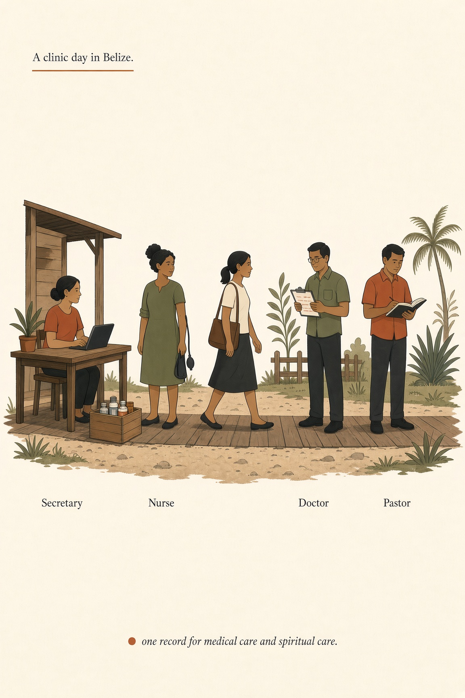
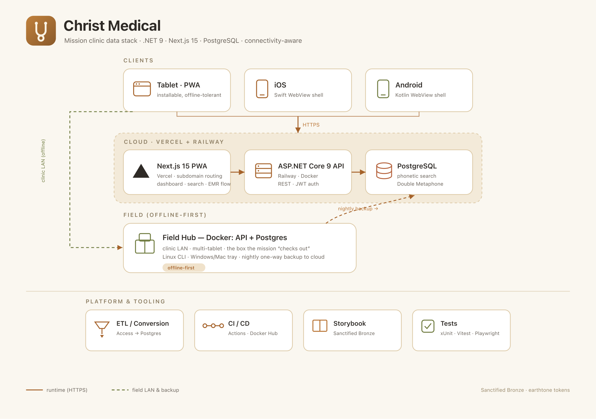

# Christ Medical

The chart a church clinic team carries to Belize. Medical care and spiritual care in the same visit.

*Personal project for a short-term church clinic. Not a hospital product.*

Secretary finds the patient even if the name is spelled differently.

Nurse records vitals.

Doctor writes the visit.

Pastor notes hope, interest, and prayer.

Leaders see visits and spiritual care on one dashboard.

Made for short-term mission clinics, starting with a team serving in Belize. Paper summary still goes home with the patient.

 

| <h3>✚ Medical care</h3> | <h3>✟ Spiritual care</h3> |
|---|---|
| History and allergies, vitals, the reason for the visit, a diagnosis, and a plan for care | Whether a patient has heard the gospel, whether they have shown hope or interest, and notes on spiritual care |

Coming next: check-in, medications, and prayer and follow-up.

## Start here

The active system is **[christmedical.com](https://github.com/christmedical/christmedical.com)** (.NET API, Next.js PWA, PostgreSQL, field hub).

Other repos in this org are the 2016 prototype.

## How the box stays up when the link dies

  <picture>
    <source media="(prefers-color-scheme: dark)" srcset="architecture-dark.png">
    
  </picture>

Tablets talk to the hub on the clinic LAN, then a nightly one-way backup carries charts home.

## License

[AGPL-3.0](https://github.com/christmedical/christmedical.com/blob/main/LICENSE), with a [commercial option](https://github.com/christmedical/christmedical.com/blob/main/COMMERCIAL-LICENSE.md).

## Get involved

Open an issue on [christmedical.com](https://github.com/christmedical/christmedical.com/issues). Questions or commercial licensing: [jamey@mcelveen.us](mailto:jamey@mcelveen.us).
